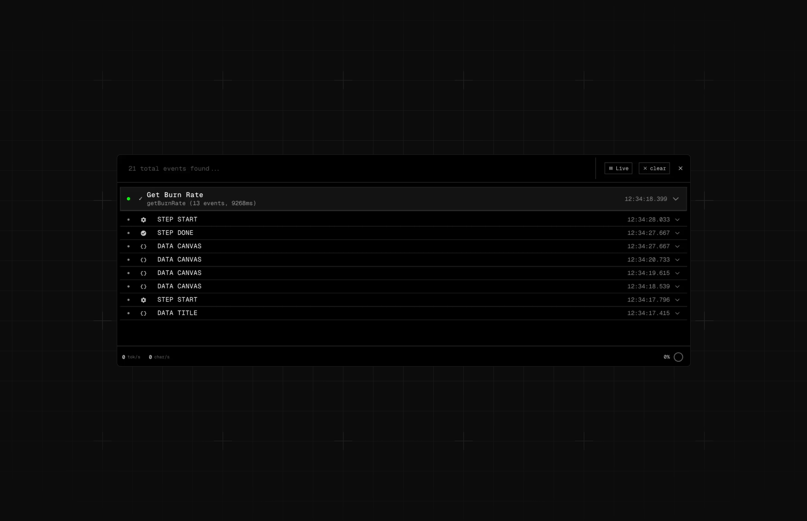

# AI SDK Tools



A collection of essential utilities for AI development. State management, debugging tools, and artifact handling - everything you need to build production-ready AI applications.

## Packages

### 🗄️ [@ai-sdk-tools/store](./packages/store)
AI chat state that scales with your application. Eliminates prop drilling within your chat components, ensuring better performance and cleaner architecture.

```bash
npm i @ai-sdk-tools/store
```

### 🔧 [@ai-sdk-tools/devtools](./packages/devtools)
Development tools for debugging AI applications. A development-only debugging tool that integrates directly into your codebase, just like react-query-devtools.

```bash
npm i @ai-sdk-tools/devtools
```

### 📦 [@ai-sdk-tools/artifacts](./packages/artifacts)
*Coming soon* - Advanced streaming interfaces for AI applications. Perfect for canvas & workflow-based UIs, handling data and actions with ease. Go beyond simple chat interfaces.

```bash
npm i @ai-sdk-tools/artifacts
```

## Getting Started

Visit our [website](https://ai-sdk-tools.vercel.app) to explore interactive demos and detailed documentation for each package.

## Used by

[](https://midday.ai)

## License

MIT